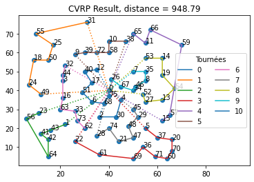

### Hi, I'm Nathan 

I'm an engineering student, interested by the use of data for solving industrial issue. 

⚡Look at my projects : 

#### [Heuristics to solve a CVRP](https://github.com/Kiwy3/CVRP)  
    

#### [Solver to teams distribution in a bus](https://github.com/Kiwy3/Bus_wei)  

<!--
* Simulation Panne et réparation sur Python
* Trouver un sujet en R
* Trouver un sujet de prévision de vente
-->
